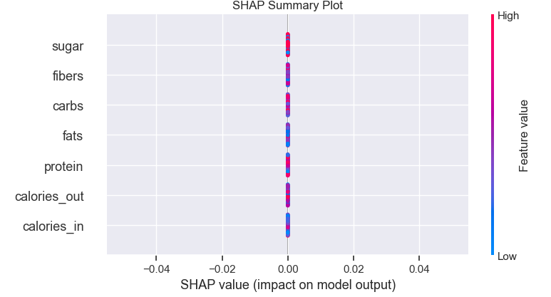

## Прогнозирование завтрашнего веса

В качестве датасета выбран набор данных и Kaggle 
https://www.kaggle.com/datasets/sangramphadke/food-and-health-data-for-one-year-day-to-day

Датасет представляет собой записи о весе и потреблённых/затраченых калориях одного мужчины.
Его целью было снижение веса на 10 кг, которую он успешно достиг в период с 1 мая 2017 г. по 31 декабря 2018 г.

Набор содержит следующие признаки (Название / значение / тип данных):

* Date : 1-May-17 Date format
* DAY : Monday Day format
* Calories Consumed in Cal: 1273 float number format
* Calories Burned in Cal (cal burn via physical exercise ): 431 float number format
* Weight in Kg : 82.5 float number format
* Protein in grams: 71 float number format
* Fats in grams : 34 float number format
* Carbs in grams : 377 float number format
* Fibers in grams : 39 float number format
* Sugar : Yes or No String format

Целевой переменной является вес.

График зависимости веса от признаков

Оценка изменения веса с чечением времени для выявления сезонности

Матрица корреляций признаков

После проведения разведночного анализа и подготовки датасета признаки будут выглядеть следующим образом:

* 'weight_today': 'Вес (кг)'
* 'calories_in': 'Количество полученных каллорий (Ккал)',
* 'calories_out': 'Количество потраченных каллорий (Ккал)',
* 'protein': 'Количество полученных белков (г)',
* 'fats': 'Количество полученных жиров (г)',
* 'carbs': 'Количество полученных углеводов (г)',
* 'fibers': 'Количество полученных пищевых волокон (г)',
* 'sugar': 'Потребление сахара (да/нет)'

Далее создаётся новый признак с названием weight_tomorrow, который является производным от признака weight_today со здвигом даты на одну позицию вверх.
Следующим создаётся признак weight_diff , считающийся по формуле:
### 'weight_diff' = 'weight_tomorrow' - 'weight_today'

weight_diff становится таргетом, 'weight_tomorrow' и 'weight_today' удаляются.

Целевой признак это плвающее число, поэтому мы строим регрессию. На место модели пртендуют следующие регрессоры:

* DecisionTreeRegressor()
* RandomForestRegressor()
* BaggingRegressor()
* AdaBoostRegressor()
* GradientBoostingRegressor()
* CatBoostRegressor()
* LightGBM
* XGBRegressor()
* LinearRegression()

По результатам обучение получены следующие метрики качества:

## DTR
* RMSE TRAIN = 0.45987912701189065 RMSE TEST = 0.702910531430803
* MAE TRAIN = 0.18671442174515232 MAE TEST = 0.42240686944634276
* R2 TRAIN = 0.0 R2 TEST = -0.00011586672233776518
## RFR
* RMSE TRAIN = 0.2099468056061118 RMSE TEST = 0.7336729516617059
* MAE TRAIN = 0.10737171052631578 MAE TEST = 0.518233766233766
* R2 TRAIN = 0.7915839571858715 R2 TEST = -0.08957024185068363
## BR
* RMSE TRAIN = 0.21465087933665677 RMSE TEST = 0.7690447777144513
* MAE TRAIN = 0.11947368421052629 MAE TEST = 0.5614285714285714
* R2 TRAIN = 0.7821397752360584 R2 TEST = -0.19716351209253413
## ADA
* RMSE TRAIN = 0.3584306032748492 RMSE TEST = 0.7302314006443725
* MAE TRAIN = 0.2044641941483729 MAE TEST = 0.48488761732120844
* R2 TRAIN = 0.3925328887314178 R2 TEST = -0.07937219199532763
## GBR
* RMSE TRAIN = 0.21014729381112285 RMSE TEST = 0.7752628599940785
* MAE TRAIN = 0.11451079712010982 MAE TEST = 0.5594980200082644
* R2 TRAIN = 0.7911857143126624 R2 TEST = -0.21660101631538597
## CAT
* RMSE TRAIN = 0.10531954808051623 RMSE TEST = 0.6995369857420878
* MAE TRAIN = 0.06538653717680197 MAE TEST = 0.48248101344617883
* R2 TRAIN = 0.9475518012927214 R2 TEST = 0.009460999725901198
## LGB
* RMSE TRAIN = 0.2641604161546444 RMSE TEST = 0.7256740727361591
* MAE TRAIN = 0.15419867908477847 MAE TEST = 0.48880758185255585
* R2 TRAIN = 0.6700500372531961 R2 TEST = -0.06594164584107043
## XGB
* RMSE TRAIN = 0.0015866470945470356 RMSE TEST = 0.8120296089171023
* MAE TRAIN = 0.0010511966873135773 MAE TEST = 0.577381300359553
* R2 TRAIN = 0.9999880965381325 R2 TEST = -0.3347316141790433
## REGR
* RMSE TRAIN = 0.45863127595395325 RMSE TEST = 0.7046721504070562
* MAE TRAIN = 0.2015691582001773 MAE TEST = 0.4375339524224575
* R2 TRAIN = 0.005419502668478682 R2 TEST = -0.005135085332978351

Вывод: лучшие метрики у модели CatBoostRegressor, на вторм DecisionTreeRegressor на третьем LinearRegression

Посмотрим, как расставлены веса у моделей.

График интерпертации результата CatBoostRegressor()

График интерпертации результата DecisionTreeRegressor()

График интерпертации результата LinearRegression()

Модели выгружаются в pkl файл, для использования в приложении. Главная страница.

Пользователь может самостоятельно выбрать модель для прогноза.
  

Результат работы приложения в фактическом и процентном выражении.

